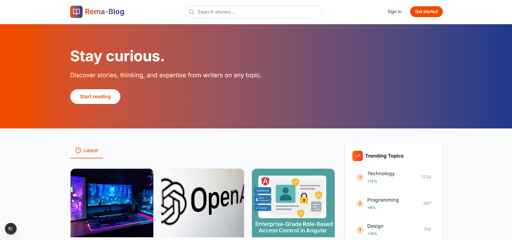
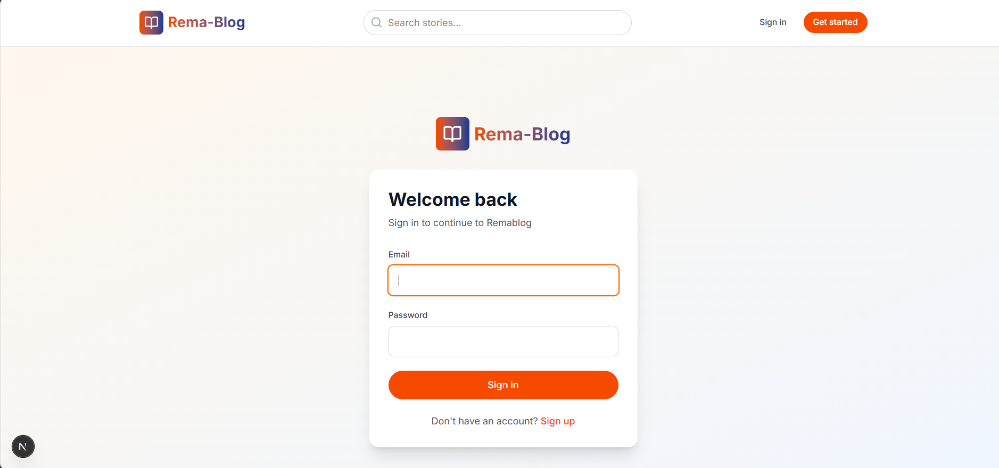
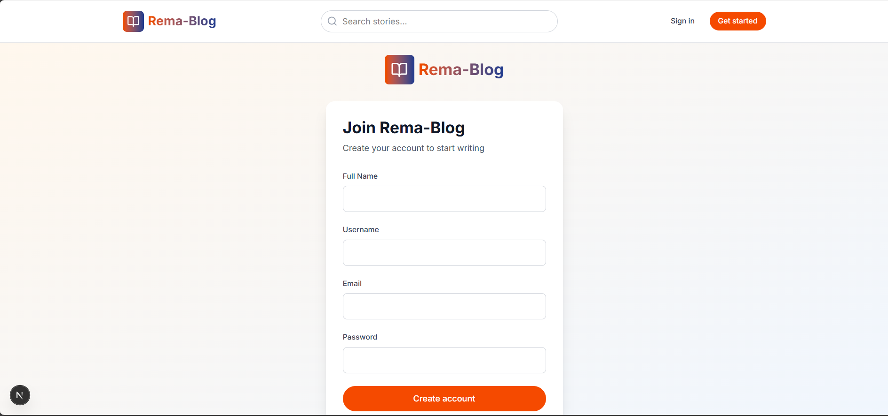
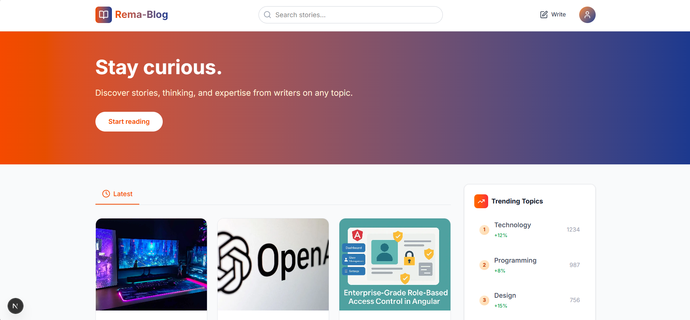
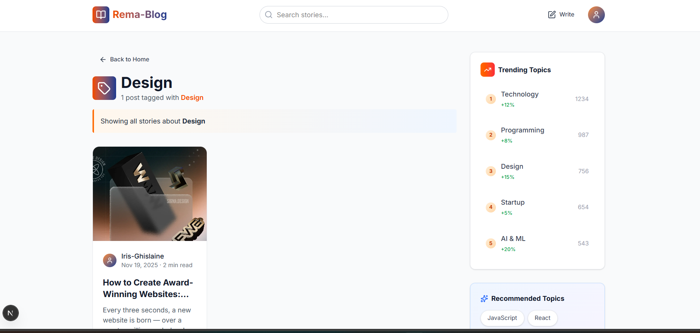
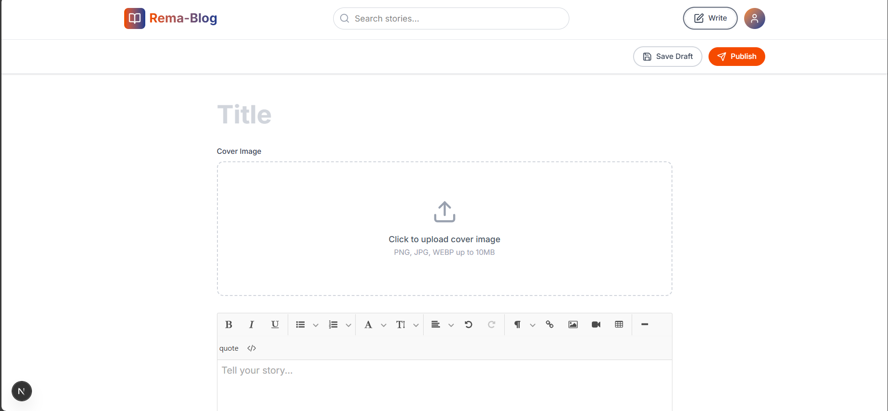
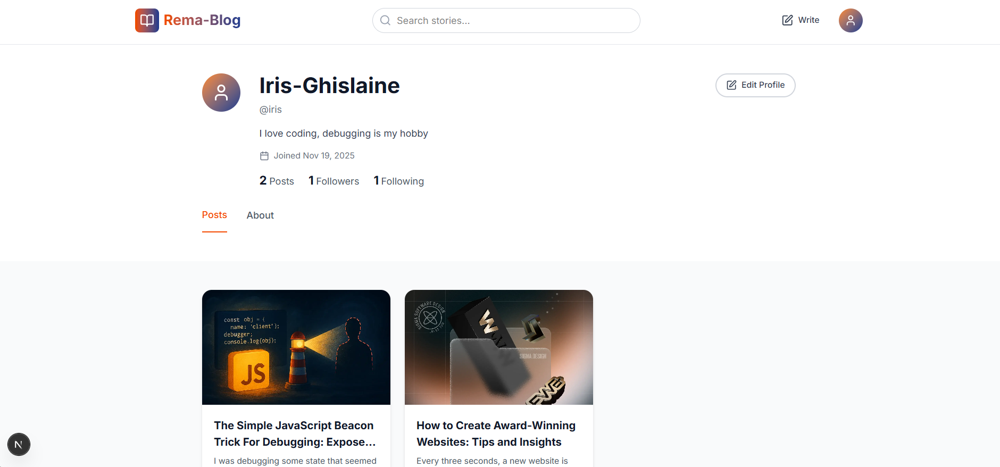
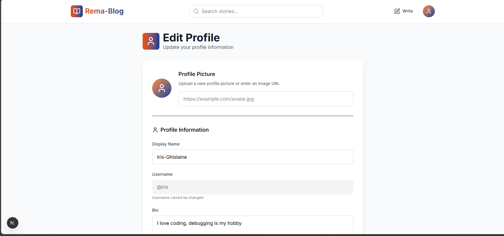
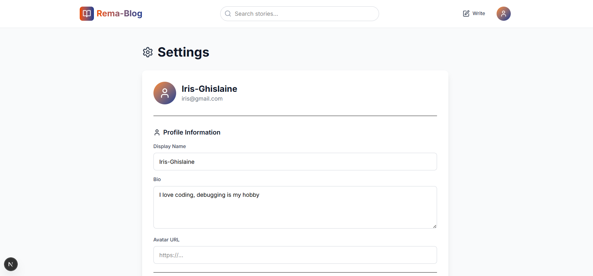
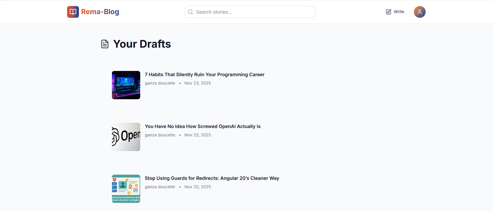

# 📝 Rema-Blog - Modern Publishing Platform

A feature-rich, Medium-inspired blogging platform built with Next.js 14, Prisma, Supabase, and Cloudinary.


## Features

###  Content Creation
- **Rich Text Editor** with Jodit - Full WYSIWYG experience
- **Image Uploads** via Cloudinary - Fast, optimized image hosting
- **Draft System** - Save and continue later
- **Cover Images** - Beautiful post headers
- **Tag System** - Organize content by topics
- **Auto-generated Excerpts** - Smart content summaries

###  User Features
- **Authentication** - Secure login/signup with NextAuth
- **User Profiles** - Customizable bio, avatar, stats
- **Follow System** - Follow favorite authors
- **Personalized Feed** - See posts from all authors
- **Edit Profile** - Update name, bio, avatar

###  Social Interactions
- **Comments** - Nested reply system 
- **Likes/Claps** - Express appreciation for posts
- **Share Posts** - Social sharing capabilities
- **Bookmarks** - Save posts for later (coming soon)

###  Discovery
- **Smart Search** - Search across titles, content, tags, authors
- **Tag Filtering** - Browse by topic
- **Trending Topics** - See what's popular
- **Recommended Topics** - Discover new content
- **Related Posts** - Based on tags

###  Design
- **Modern UI** - Clean, professional interface
- **Responsive** - Works on all devices
- **Dark Mode Ready** - Easy theme switching (coming soon)
- **Smooth Animations** - Polished user experience
- **Toast Notifications** - Beautiful feedback messages

---

##  Quick Start

### Prerequisites
- Node.js 18+ installed
- Supabase account (free tier works)
- Cloudinary account (free tier works)
- Git

### Installation

1. **Clone the repository**
```bash
git clone https://github.com/Iris-Ghislaine/phase-2-capstone
cd phase-2-capstone
```

2. **Install dependencies**
```bash
npm install
```

3. **Set up environment variables**

Create `.env` in the root directory:

```env
# Database (Supabase)
DATABASE_URL="postgresql://postgres:[PASSWORD]@[HOST]:[PORT]/postgres?pgbouncer=true"
DIRECT_URL="postgresql://postgres:[PASSWORD]@[HOST]:[PORT]/postgres"

# NextAuth
NEXTAUTH_URL="http://localhost:3000"
NEXTAUTH_SECRET="generate-with-openssl-rand-base64-32"

# Cloudinary
NEXT_PUBLIC_CLOUDINARY_CLOUD_NAME="your-cloud-name"
NEXT_PUBLIC_CLOUDINARY_UPLOAD_PRESET="ml_default"
```

4. **Set up Supabase**

- Create a new project at [supabase.com](https://supabase.com)
- Get your database connection string from Settings > Database
- Update `DATABASE_URL` and `DIRECT_URL` in `.env`

5. **Set up Cloudinary**

- Create account at [cloudinary.com](https://cloudinary.com)
- Go to Settings > Upload
- Create an upload preset named "ml_default" (or use existing)
- Set it to **Unsigned**
- Get your cloud name from Dashboard
- Update environment variables

6. **Initialize database**
```bash
npx prisma generate
npx prisma db push
```

7. **Run development server**
```bash
npm run dev
```

Visit [http://localhost:3000](http://localhost:3000)

---

##  Project Structure

```
rema-blog/
├── prisma/
│   └── schema.prisma          # Database models
├── src/
│   ├── app/                   # Next.js 14 App Router
│   │   ├── (auth)/           # Auth pages (login, signup)
│   │   ├── (dashboard)/      # Protected pages (new-story, drafts)
│   │   ├── api/              # API routes
│   │   ├── post/             # Post detail pages
│   │   ├── profile/          # User profiles
│   │   ├── tag/              # Tag pages
│   │   ├── search/           # Search results
│   │   ├── layout.tsx        # Root layout
│   │   └── page.tsx          # Home page
│   ├── components/
│   │   ├── editor/           # Rich text editor components
│   │   ├── layout/           # Header, Footer, Sidebar
│   │   ├── post/             # Post cards, lists, actions
│   │   ├── comments/         # Comment system
│   │   └── ui/               # Reusable UI components
│   ├── hooks/                # Custom React hooks
│   ├── lib/                  # Utilities & configs
│   ├── context/              # React Context providers
│   └── types/                # TypeScript types
├── public/                   # Static assets
├── .env                      # Environment variables 
├── next.config.ts            # Next.js configuration
├── tailwind.config.js        # Tailwind CSS config
└── package.json              # Dependencies
```

---

## Database Schema

### Models

#### User
- Authentication & profile data
- Stores: id, email, username, name, password, bio, avatar
- Relations: posts, comments, likes, followers, following

#### Post
- Blog articles and content
- Stores: id, title, slug, content, excerpt, coverImage, published status
- Relations: author, tags, comments, likes

#### Comment
- Comments with nested replies
- Stores: id, content, authorId, postId, parentId
- Supports up to 3 levels of nesting

#### Tag
- Content categorization
- Stores: id, name, slug
- Smart matching system for existing tags

#### Like
- Post appreciation system
- One like per user per post

#### Follow
- User follow relationships
- Enables personalized feeds

---

## Key Technologies

### Frontend
- **Next.js 14** - React framework with App Router
- **TypeScript** - Type safety throughout
- **Tailwind CSS** - Utility-first styling
- **Jodit React** - Rich text editor
- **Lucide React** - Beautiful icons
- **React Hot Toast** - Toast notifications

### Backend
- **Next.js API Routes** - Server-side logic
- **NextAuth** - Authentication
- **Prisma** - Database ORM
- **PostgreSQL** - Database (via Supabase)

### Services
- **Supabase** - Database hosting
- **Cloudinary** - Image hosting & optimization
- **Vercel** - Deployment platform 

### State Management
- **TanStack Query (React Query)** - Server state
- **React Context** - Global UI state
- **React Hooks** - Local component state

---

##  Features Guide

### Creating a Post

1. Click **Write** button in header
2. Add a title
3. Upload cover image (optional)
4. Write content with rich text editor
5. Click **Publish** or **Save Draft**
6. Add excerpt and tags
7. Publish!

### Image Upload

Images are uploaded to Cloudinary:
- Max size: 10MB
- Formats: JPG, PNG, WEBP
- Auto-optimization
- CDN delivery

### Tag System

Tags use smart matching:
- Creates new tags if they don't exist
- Reuses existing similar tags
- Works with any existing tag slugs

Example:
- You type: "JavaScript"
- System checks: javascript, javascript-xyz, js
- Finds match or creates clean tag

### Search

Search across:
- Post titles
- Post content
- Post excerpts
- Tag names
- Author names


---

## Environment Variables

### Required

```env
DATABASE_URL              # Supabase connection string
DIRECT_URL               # Supabase direct connection
NEXTAUTH_URL             # Your app URL
NEXTAUTH_SECRET          # Random secret key
NEXT_PUBLIC_CLOUDINARY_CLOUD_NAME    # Cloudinary cloud name
NEXT_PUBLIC_CLOUDINARY_UPLOAD_PRESET # Cloudinary preset
```

### Optional

```env
CLOUDINARY_API_KEY       # For server-side uploads
CLOUDINARY_API_SECRET    # For server-side uploads
```

---
### screenshots

# Sign In page


# home page before logging in




# Sign In



# Sign Up



# home page after logging in



## fetching posts according to tags



## write section



## profile



## edit profile



## settings page



## Drafts page



## footer


## Testing

### Manual Testing Checklist

**Authentication:**
- [ ] Sign up with new account
- [ ] Login with existing account
- [ ] Logout
- [ ] Access protected routes

**Posts:**
- [ ] Create draft
- [ ] Publish post
- [ ] Edit post
- [ ] Delete post
- [ ] Upload cover image
- [ ] Add tags

**Social:**
- [ ] Like/unlike post
- [ ] Add comment
- [ ] Reply to comment
- [ ] Delete own comment
- [ ] Follow/unfollow user

**Discovery:**
- [ ] Search for posts
- [ ] Click trending topics
- [ ] Filter by tags
- [ ] View user profiles

### Running Tests

```bash
# Unit tests
npm test

# Watch mode
npm run test:watch

# Coverage
npm run test:coverage
```

---

##  Deployment

### Deploy to Vercel (Recommended)

1. **Push to GitHub**
```bash
git add .
git commit -m "Initial commit"
git push origin main
```

2. **Import to Vercel**
- Go to [vercel.com](https://vercel.com)
- Click "New Project"
- Import your GitHub repository
- Add environment variables
- Deploy!

3. **Configure Environment Variables**

Add all variables from `.env.local` to Vercel:
- Go to Project Settings > Environment Variables
- Add each variable
- Redeploy

4. **Update NextAuth URL**
```env
NEXTAUTH_URL="https://your-app.vercel.app"
```

### Build Locally

```bash
# Production build
npm run build

# Start production server
npm start
```

---

##  Troubleshooting

### Image Upload Not Working

**Problem:** Images fail to upload

**Solutions:**
1. Check Cloudinary credentials in `.env`
2. Verify upload preset is "unsigned"
3. Check file size (max 10MB)
4. Check file format (JPG, PNG, WEBP)

### Database Connection Issues

**Problem:** Can't connect to database

**Solutions:**
1. Verify Supabase credentials
2. Check if database is paused (free tier)
3. Use `DIRECT_URL` for migrations
4. Use `DATABASE_URL` for queries

### Build Errors

**Problem:** TypeScript errors during build

**Solutions:**
1. Delete `.next` folder: `rm -rf .next`
2. Clear node_modules: `rm -rf node_modules && npm install`
3. Regenerate Prisma: `npx prisma generate`
4. Try again: `npm run build`

---

## API Documentation

### Posts

```typescript
GET    /api/posts              // Get all posts
GET    /api/posts?tag=react    // Filter by tag
GET    /api/posts?search=next  // Search posts
GET    /api/posts/[id]         // Get single post
POST   /api/posts              // Create post
PUT    /api/posts/[id]         // Update post
DELETE /api/posts/[id]         // Delete post
```

### Comments

```typescript
GET    /api/comments?postId=123  // Get post comments
POST   /api/comments             // Create comment
DELETE /api/comments/[id]        // Delete comment
```

### Users

```typescript
GET    /api/users/[username]    // Get user profile
PUT    /api/users/[username]    // Update profile
```

### Social

```typescript
POST   /api/likes                // Toggle like
POST   /api/follow               // Toggle follow
```

---

## Roadmap

### In Progress
- [ ] Bookmark system
- [ ] Notifications
- [ ] Email verification
- [ ] Password reset
- [ ] Dark mode

### Code Style

- Use TypeScript for all files
- Follow ESLint rules
- Use Prettier for formatting
- Write meaningful commit messages

## Built for

This project is done as a part of my capstone phase 2 during my bootcamp at Igire Rwanda
